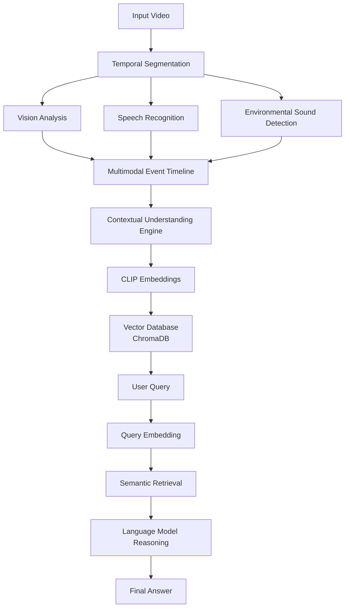
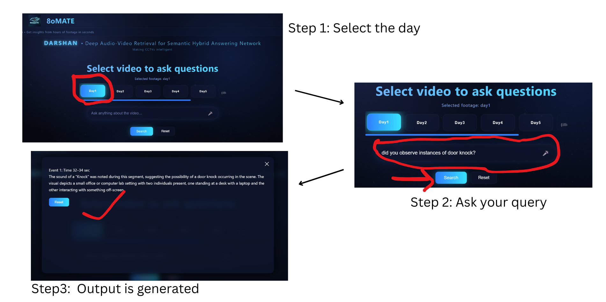

# DARSHAN

### Deep Audio-Video Retrieval for Semantic Hybrid Answering Network

[]()
[]()
[]()
[]()
[]()

DARSHAN is a **multimodal video intelligence framework** that transforms raw video into structured, searchable knowledge.
The system integrates **vision, speech recognition, environmental sound detection, semantic embeddings, and language model reasoning** to enable natural language interaction with video content.

DARSHAN is designed with a strong emphasis on **privacy-preserving AI**, enabling future deployments on **edge devices such as Raspberry Pi and NVIDIA Jetson platforms**.

---

# Table of Contents

* Overview
* Abstract
* Key Features
* Architecture
* Models Used
* Demo
* Installation
* Running the Pipeline
* API Usage
* Roadmap
* Limitations
* Contributing
* Citation
* References
* License
* Acknowledgements

---

# Overview

Video understanding is inherently multimodal. Humans interpret scenes using a combination of visual perception, speech understanding, contextual reasoning, and environmental audio.

DARSHAN replicates this process by combining multiple AI models into a unified system capable of answering questions about events in video streams.

Example queries:

```
When did someone enter the room?
What happened after the door opened?
When were people working together?
```

DARSHAN converts raw video into **machine-interpretable knowledge**, making it searchable and analyzable.

---

# Abstract

Understanding complex visual environments requires integrating information from multiple modalities including vision, speech, and environmental audio. Existing approaches often rely on unimodal models or manual annotations, limiting their ability to reason over temporal events in videos.

DARSHAN introduces a modular multimodal architecture that combines video segmentation, multimodal perception, semantic embeddings, vector retrieval, and language model reasoning to construct structured representations of video events.

This enables natural language querying of video streams and provides a foundation for privacy-preserving intelligent camera systems and edge AI deployments.

---

# Key Features

* Multimodal video understanding
* Automatic temporal video segmentation
* Vision-based scene description
* Speech transcription
* Environmental sound detection
* CLIP-based semantic embeddings
* Vector search using ChromaDB
* Natural language querying of video events
* FastAPI REST API interface
* Designed for edge-AI deployment

---

# Architecture

DARSHAN processes videos through a structured multimodal pipeline.



This pipeline converts **raw video → structured knowledge → natural language answers**.

---

# Models Used

* GPT-4o for video analysis
* PANNs for background noise classification
* GPT-4o for speech recognition
* GPT-4o for reasoning

---

# Demo



## Basic Understanding:

Query by User:
```
What are the people doing in the room?
```
Response:
```
Two individuals are present in a small office. One person is standing near a desk with a laptop while the other is facing away from the camera holding an object. This activity occurs around 28–30 seconds.
```

Query by User:
```
What is happening around the laptop?
```
Response:
```
One person is using a laptop at a desk while another individual stands nearby observing. This interaction happens around 30–32 seconds in the video.
```

## Moderate-Level Understanding

Query by User:
```
What activities are taking place in the room?
```
Response:
```
Two individuals are present in a small office. One person is working at a desk with a laptop while the other appears to be interacting with something off-screen. This occurs around 32–34 seconds.
```

Query by User:
```
What happens when another person enters the room?
```
Response:
```
A third person enters the room, increasing the number of people from two to three. Shortly afterward, the door is closed and the number of people returns to two. This sequence occurs around 36–38 seconds.
```

## Spatiotemporal Reasoning

Query by User:
```
How does the number of people in the room change during the video?
```
Response:
```
Initially, two individuals are present in the office. Later, a third person enters the room. After the door is closed, the number of people in the room returns to two. These changes occur around 36–38 seconds in the video.
```

Query by User:
```
What are the people doing later in the video?
```
Response:
```
Three individuals are present in the office. One person is interacting with a laptop or monitor, another is walking through the room, and a third person is near a desk. This activity occurs around 40–42 seconds.
```

Future releases will include:

Edge Processing: Run the entire pipeline on edge devices such as **Raspberry Pi or NVIDIA Jetson**, reducing dependence on cloud infrastructure.

Real-Time Inference: Optimize the system so that video analysis can be performed **in real-time or near real-time**, instead of processing only recorded video clips.

Smart CCTV Hardware: Develop a **complete intelligent camera unit** consisting of a camera and microphone integrated with a **Raspberry Pi Zero W**, with WiFi/Bluetooth connectivity for local storage and processing. This will ensure **user-controlled data and improved privacy**.

Voice-Based Interface: Add a **voice-enabled interaction system** where users can ask questions using voice commands and receive spoken responses. Future versions may support **multilingual voice interaction** and hands-free operation.

---

# Installation

### Clone the repository

```bash
git clone https://github.com/nandisagnik/DARSHAN.git
cd DARSHAN
```

---

### Install dependencies

```bash
pip install -r requirements.txt
```

---

### Configure environment variables

Create a `.env` file:

```
OPENAI_API_KEY=your_api_key_here
```

---

# Running the Pipeline

### 1. Segment the video

```bash
python temporal_segments.py
```

---

### 2. Run the segments

```bash
python run_segments.py
```

---

### 3. Analyze the segments

```bash
python analyze_segments.py
```

---

### 4. Build the vector database

```bash
python build_vector_db_clip.py
```

---

### 5. Ask questions

```bash
python ask_video_clip.py
```

Example query:

```
When did someone leave the room?
```

---

# API Usage

Start the FastAPI server:

```bash
uvicorn api:app --reload
```

Open the API documentation:

```
http://127.0.0.1:8000/docs
```

FastAPI automatically generates interactive API documentation.

---

# Roadmap

Planned developments include:

* Edge deployment on Raspberry Pi and NVIDIA Jetson
* Real-time video processing
* Person tracking
* Multi-video knowledge memory
* Voice-enabled user interface
* Privacy-preserving intelligent camera systems

See **ROADMAP.md** for details.

---

# Limitations

Current challenges include:

* latency in local model inference
* computational cost of multimodal processing
* hardware constraints for edge deployment
* limited availability of unified multimodal models

See **docs/LIMITATIONS.md**.

---

# Contributing

We welcome community contributions.

Please read:

**CONTRIBUTING.md**

before submitting pull requests.

---

# Citation

If you use DARSHAN in your research, please cite:

```bibtex
@software{darshan2026,
  title={DARSHAN: Deep Audio-Video Retrieval for Semantic Hybrid Answering Network},
  author={8oMATE Team},
  year={2026},
  url={https://github.com/nandisagnik/DARSHAN}
}
```

---

# References

The development of DARSHAN is inspired by recent research in multimodal video understanding and audio-visual language models.

- **Video-SALMONN-2: A Unified Audio-Visual Language Model for Video Understanding**  
  https://github.com/bytedance/video-SALMONN-2

These works demonstrate the potential of combining visual, audio, and language modalities to build intelligent video reasoning systems.

---

# License

DARSHAN is released under the **MIT License**.

See **LICENSE** for details.

---

# Acknowledgements

DARSHAN builds upon the contributions of several outstanding open-source projects:

* PyTorch
* HuggingFace Transformers
* ChromaDB
* FastAPI
* OpenCV
* Librosa

These tools make modern multimodal AI research possible.

---

# Maintainers

Developed by the **8oMATE team**

Project repository:

https://github.com/nandisagnik/DARSHAN
